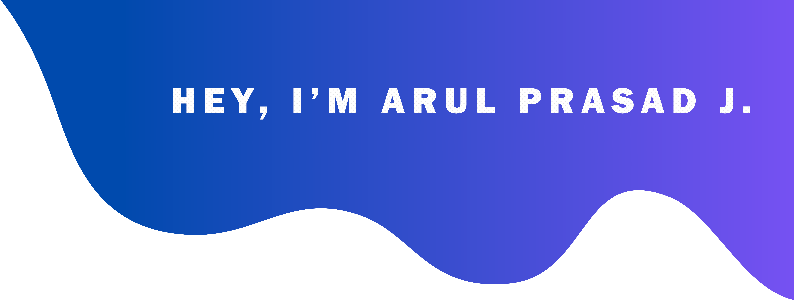

I love coding in PHP, WordPress. I am passionate about technologies and love to learn new things.

⚡ Fun fact:
- 👯 I’m looking to collaborate on projects that are using PHP, WordPress, WordPress Plugin.
- :pencil2: I Write blogs on dev.to on free days.
- :musical_note: I love to hear country music.

- 💬 Happy to talk about WordPress, JavaScript, coding best practices, team collaboration and any other technical or non-technical topics.
- 📫 Feel free to reach at info@arulprasadj.com and [LinkedIn](https://www.linkedin.com/in/arulprasadj/).

 <em><b>I love connecting with different people</b> so if you want to say <b>hi, I'll be happy to meet you more!</b> 😊</em>

### Let's Connect :coffee:

	
	
	

